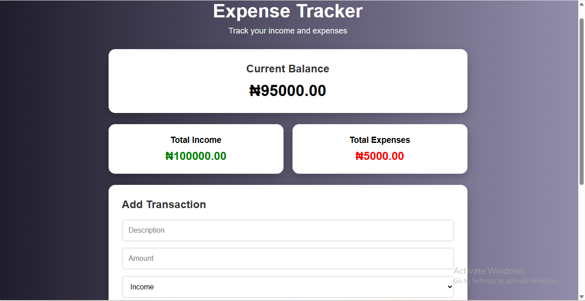

# 💰 Expense Tracker

A responsive expense tracker built with HTML, CSS, and JavaScript.

The application allows users to add income and expenses, automatically calculate their balance, and save transactions using Local Storage.

## 🚀 Features

- Add income transactions
- Add expense transactions
- Calculate total income
- Calculate total expenses
- Automatically calculate current balance
- Delete transactions
- Save transactions using Local Storage
- Responsive design for mobile and desktop
- Dynamic DOM manipulation

## 🛠️ Technologies Used

- HTML5
- CSS3
- JavaScript (ES6)
- Local Storage
- Git & GitHub

## 📸 Screenshot

## 📸 Screenshot

## 📂 Project Structure

Expense-Tracker/
│
├── index.html
├── styles.css
├── script.js
└── README.md

## 💡 What I Learned

- Working with JavaScript arrays and objects
- DOM manipulation
- Handling form events
- Using Local Storage
- Creating responsive layouts
- Calculating and displaying dynamic data
- Using Git and GitHub for version control

## 👨‍💻 Author

**Raji Ridwan Olalekan**

GitHub:
https://github.com/olamilekanr876-cpu